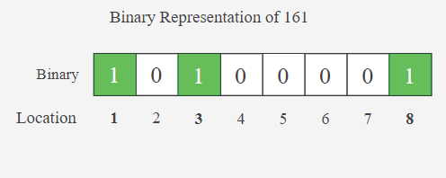

# Counting Bits

Given an integer, ``n``, determine the following:

 

1. How many 1-bits are in its binary representation?
2. The number n's binary representation has k significant bits indexed from 1 to k. What are the respective positions of each 1-bit, in ascending order?
 

For example, the diagram below depicts this information for the value **n = 37**:

</img>

In the binary representation of 37, there are three 1-bits located at the respective 1st, 4th, and 6th positions.

**Note:**  The leftmost 1 bit is always position 1. Preceding zeros are not considered in determining the position.

### Function Description 

Complete the function getOneBits in the editor below. The function must return a results array with the number of 1's stored at results[0] followed by the positions of all 1's in its binary representation in ascending order.

 

``getOneBits`` has the following parameter(s):

- ``n:``  an integer

 

### Constraints

1 < n < 109

 
### Sample input

    161

### Sample output

    3
    1
    3
    8
### Explanation

**The integer n = (161)10 converts to (10100001)2:**

In the binary representation of **161**, there are 3 1-bits located at the **1st**, **3rd**, and **8th** positions.

Because there are three 1-bits, the return array is 3 + 1 = 4 units in length. Store the 1's count, 3, at index 0. Then store the locations of the 1-bits in order, low to high. Return the array ``[3, 1, 3, 8]`` as the answer.

